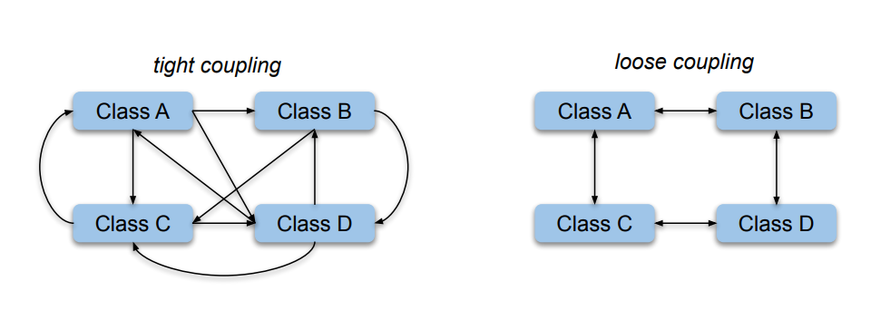
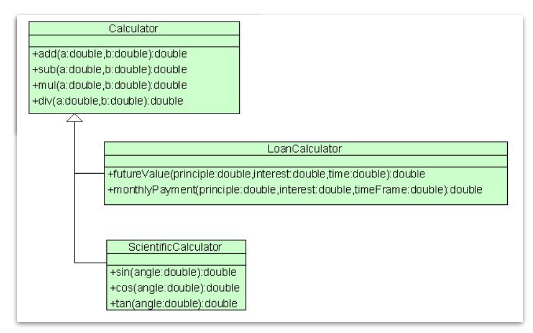
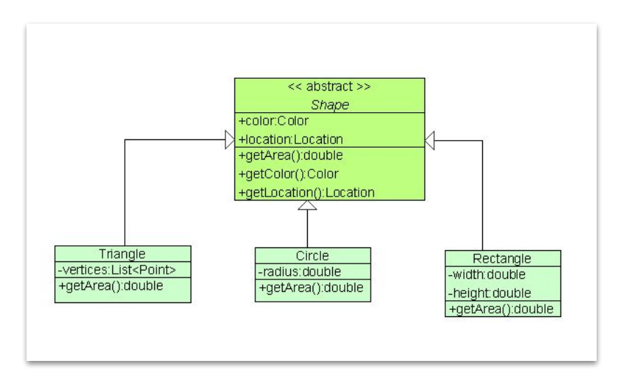
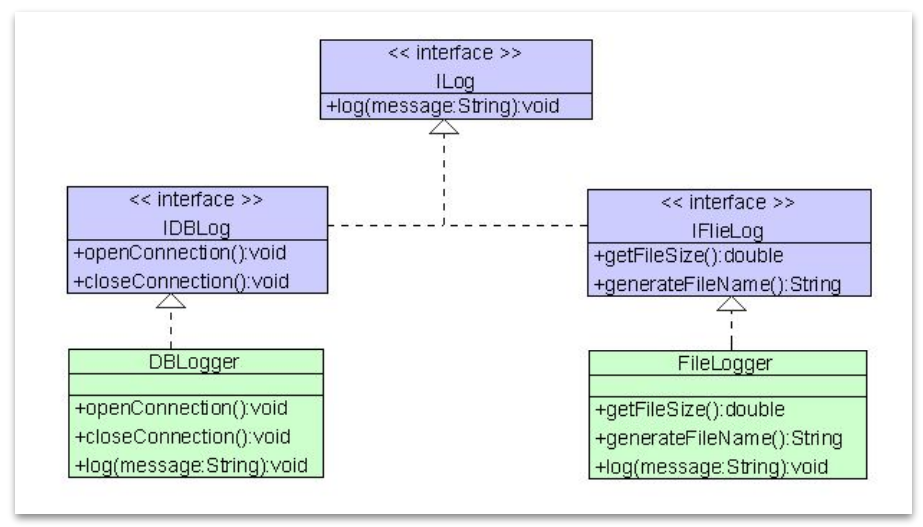
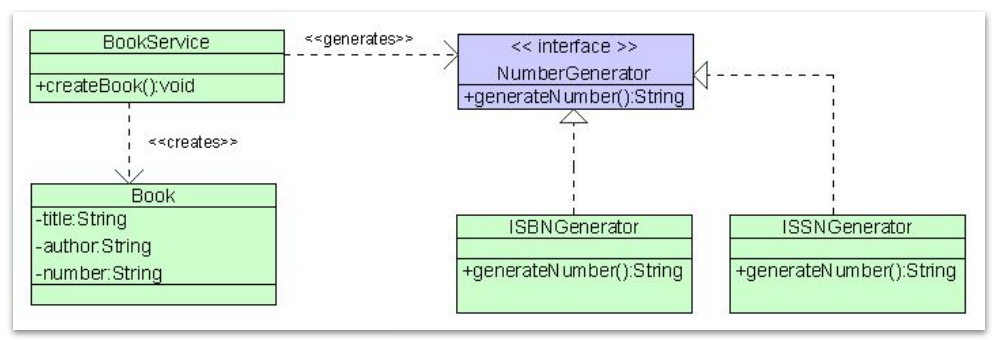

# What makes a Great Architecture?

## What are the hallmarks of a good architecture?
1. Loose Coupling - 컴포넌트간 결합도 약화
2. Separation of Concern - 아키택쳐 세분화
3. Law of Demeter (LoD) - 속성을 숨기고 함수를 보여줌 (캡슐화)
4. SOLID Principles - OOP 설계

### Loose Coupling 

여러개의 클래스가 있을 때 서로간의 연관성을 줄여서 전체적인 복잡성을 줄인다.
하나의 컴포넌트는 최소한의 컴포넌트에 의해서 영향을 받아야 한다. 

### Separate of Concern
기능적으로 공통적읜 것들의 집합을 게층으로 만들어서 표현
eg. 3 tie layer architecture 
1. Presentation Layer 
2. Business Layer
3. Resource(Data) Access Layer

관심사의 분리를 통해서 각 계층에서의 모듈화와 캡슐화를 할 수 있다.

### Law of Demeter 
1. Each unit should have only limited knowledge about other units: only units "closely" related to the current unit.
   각각의 개체는 서로 다른 개체에 대해서 한정적으로 알아야 한다. 밀접한 개체들간의 관계만 갖는다.  
2. Each unit should only talk to its friends; don't talk to strangers.
   각 개체들은 연관된 개체들 사이에서의 통신만을 한다. 
3. Only talk to your immediate friends.
   가까운 개체만 통신을 한다. 
4. 

A와 B는 연관이 있어 통신할 수 있지만, A와 C는 모르는 사이라 통신할 수 없다. 
> a.k.a Principle of Least Knowledge

## SOLID Design Principle
1. The Single-responsibility principle: 하나의 클래스의 변경은 하나의 이유로만 일어나아 햔다.
2. The Open-closed principle: 각 엔티티(클래스)는 확장에는 열려있고 변경에는 닫혀있어야 한다.
3. The Liskov substitution principle: 파생된 객체는 부모 객체가 알고있는 것들을 알아야 한다. 
4. The Interface segregation principle: 사용자는 사용하지 않는 인터페이스에 영향을 받지 않는다. (인터페이스 세분화)
5. The Dependency inversion principle: 구현체가 아닌 추상체에 의존해야 한다. 

### Single-Responsibility Principle
클래스는 하나의 작업만 가져야 하고, 하나의 이유로만 변경이 된다.
e.g. 하나의 책임 예
1. Persistence 
2. Pre/Post Conditions - Validation
3. Notification
4. Logging
5. Formatting
6. Parsing
7. Error Handling

위처럼 클래스는 하나의 책임만을 전문적으로 다룬다. 

### Open-Closed Principle

위처럼 `Calculate` class에 기능을 추가하거나 변경하고싶을 때는, `Calculate` class를 직접 수정하는 것이 아니라 확장/상속하여 새로운 가능을 추가하여야 한다.  

### Liskov Substitution Principle
 Class B가 Class A의 하위 타입일 때 프로그램에서 아무 문제 없이 A 대신에 B를 사용할 수 있어야 한다.
 
 위에서 `Shape`의 하위 클래스들은 `Shape`의 모든 기능을 사용할 수 있어야 한다.  

### Interface Segregation Principle
인터페이스의 세분화.

위와 같이 `FileLogger`에서는 `openConnection / closeConnection` 함수가 필요 없다.  
하나의 interface에서만 확장한 경우에는 특정 Logger class에서 사용하지 않는 함수가 들어갈 수 있기 때문에 
interface를 필요한 기능들만 묶어 세분화하여 작성한다.  

### Dependency Inversion Principle
구현체가 아닌 추상체에 의존해야 한다.

위에서 처럼 `BookService`가 `NumberGenerator` interface를 의존하여 생성하는 번호가 ISBN인지 ISSN인지는 알 필요는 없다.    
하위 클래스간 의존한다면 클래스 수정에 많은 비용이 들지만 상위 interface/abstract를 의존하면 간단히 수정 가능하다.  