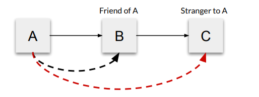

# What makes a Great Architecture?

## What are the hallmarks of a good architecture?
1. Loose Coupling - 컴포넌트간 결합도 약화
2. Separation of Concern - 아키택쳐 세분화
3. Law of Demeter (LoD) - 속성을 숨기고 함수를 보여줌 (캡슐화)
4. SOLID Principles - OOP 설계

### Loose Coupling 

여러개의 클래스가 있을 때 서로간의 연관성을 줄여서 전체적인 복잡성을 줄인다.
하나의 컴포넌트는 최소한의 컴포넌트에 의해서 영향을 받아야 한다. 

### Separate of Concern
기능적으로 공통적읜 것들의 집합을 게층으로 만들어서 표현
eg. 3 tie layer architecture 
1. Presentation Layer 
2. Business Layer
3. Resource(Data) Access Layer

관심사의 분리를 통해서 각 계층에서의 모듈화와 캡슐화를 할 수 있다.

### Law of Demeter 
1. Each unit should have only limited knowledge about other units: only units "closely" related to the current unit.
   각각의 개체는 서로 다른 개체에 대해서 한정적으로 알아야 한다. 밀접한 개체들간의 관계만 갖는다.  
2. Each unit should only talk to its friends; don't talk to strangers.
   각 개체들은 연관된 개체들 사이에서의 통신만을 한다. 
3. Only talk to your immediate friends.
   가까운 개체만 통신을 한다. 
4. 

A와 B는 연관이 있어 통신할 수 있지만, A와 C는 모르는 사이라 통신할 수 없다. 
> a.k.a Principle of Least Knowledge

